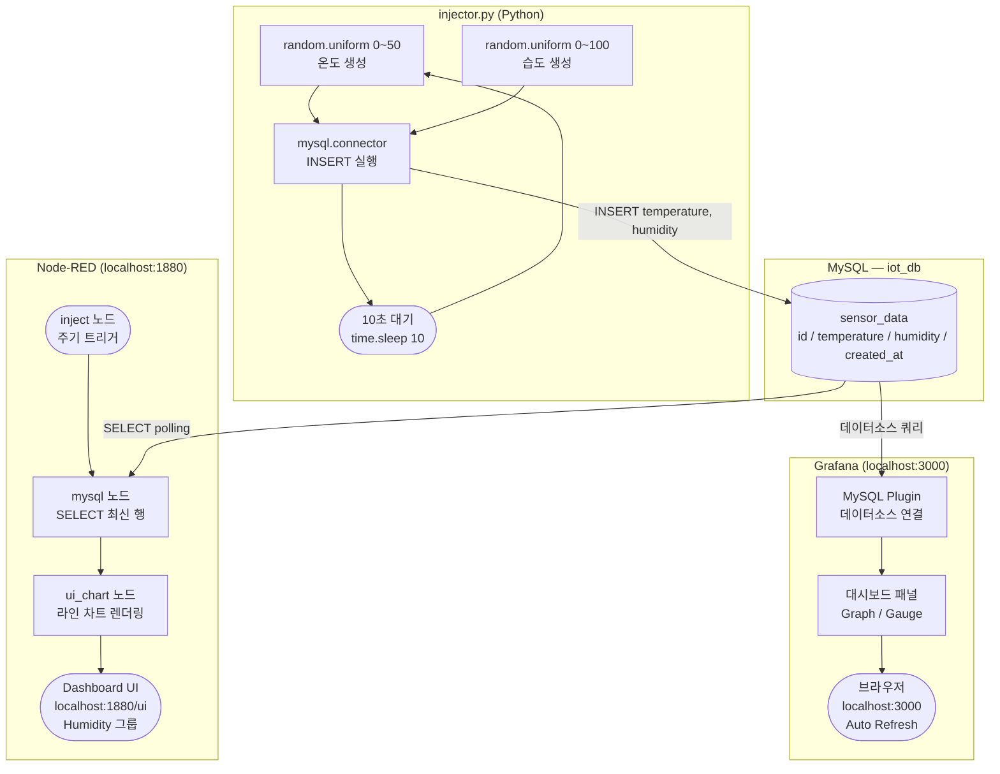
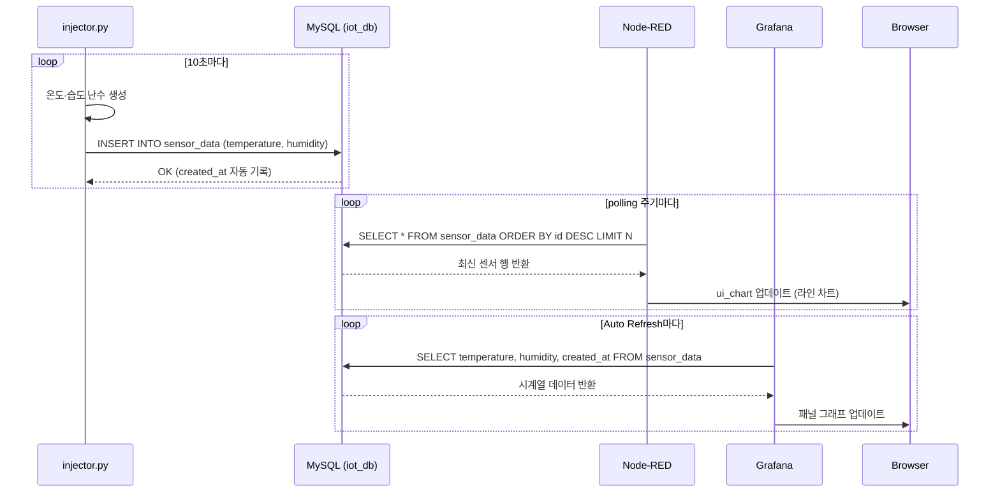

# lamp-node-red-monitor

MySQL(LAMP)에 센서 난수 데이터를 주입하고, Node-RED 대시보드와 Grafana로 실시간 모니터링하는 프로젝트입니다.

---

## 시스템 구성

| 구성 요소 | 역할 | 접속 주소 |
|---|---|---|
| `injector.py` | 10초마다 난수(온도·습도)를 생성해 MySQL에 INSERT | - |
| MySQL (LAMP) | 센서 데이터 저장소 (`iot_db.sensor_data`) | localhost:3306 |
| Node-RED | MySQL 폴링 → 웹 대시보드 실시간 표시 (라인 차트) | localhost:1880/ui |
| Grafana | MySQL을 데이터소스로 연결해 패널 실시간 표시 | localhost:3000 |

---

## 동작 설명

### 1. 데이터 생성 — `injector.py`

- `random.uniform(0, 50)` → 온도(°C), `random.uniform(0, 100)` → 습도(%)를 소수점 1자리로 반올림
- `mysql.connector`로 `iot_db.sensor_data` 테이블에 **10초 간격**으로 INSERT
- `created_at`은 MySQL `DEFAULT CURRENT_TIMESTAMP`로 자동 기록

### 2. 데이터 저장 — MySQL (`iot_db.sensor_data`)

```sql
CREATE TABLE sensor_data (
    id          INT AUTO_INCREMENT PRIMARY KEY,
    temperature FLOAT NOT NULL,
    humidity    FLOAT NOT NULL,
    created_at  DATETIME DEFAULT CURRENT_TIMESTAMP
);
```

### 3. 실시간 시각화 — Node-RED

- `inject` 노드가 일정 주기로 트리거 → `mysql` 노드가 최신 데이터 SELECT
- `ui_chart` (라인 차트, Humidity 그룹) 노드가 결과를 대시보드에 렌더링
- 대시보드 탭 "chart" 아이콘(`dashboard`)으로 구성

### 4. 실시간 시각화 — Grafana

- MySQL Plugin을 데이터소스로 연결
- 패널에서 `sensor_data` 테이블을 쿼리해 온도·습도 그래프 표시
- 자동 새로고침(Auto Refresh) 간격으로 최신 데이터 반영

---

## 전체 데이터 흐름 Flowchart



---

## 상세 시퀀스 다이어그램



---

## 실행 방법

### 1. MySQL DB 초기화

```bash
sudo mysql -u root -p < sql/setup.sql
```

사용자 생성 (최초 1회):

```sql
CREATE USER 'iot_user'@'localhost' IDENTIFIED BY 'Iot_pass1!';
GRANT ALL PRIVILEGES ON iot_db.* TO 'iot_user'@'localhost';
FLUSH PRIVILEGES;
```

### 2. Python 의존성 설치

```bash
pip install mysql-connector-python
```

### 3. injector 실행

```bash
python injector.py
```

### 4. Node-RED 실행

```bash
node-red
```


### 5. Grafana 실행

```bash
sudo systemctl start grafana-server
```


---

## 디렉토리 구조

```
lamp-node-red-monitor/
├── injector.py          # 난수 생성 및 MySQL INSERT (10초 간격)
├── sql/
│   └── setup.sql        # DB·테이블 생성 스크립트
├── nodered/
│   └── flows.json       # Node-RED 플로우 설정 (ui_chart, mysql node)
└── project.md           # 프로젝트 문서 (이 파일)
```
