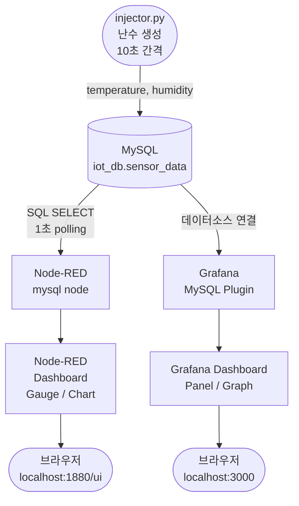

# lamp-node-red-monitor

MySQL(LAMP)에 센서 난수 데이터를 주입하고, Node-RED 대시보드와 Grafana로 실시간 모니터링하는 프로젝트입니다.

---

## 시스템 구성

| 구성 요소 | 역할 |
|---|---|
| `injector.py` | 10초마다 난수(온도·습도)를 생성해 MySQL에 INSERT |
| MySQL (LAMP) | 센서 데이터 저장소 |
| Node-RED | MySQL 조회 → 웹 대시보드 실시간 표시 |
| Grafana | MySQL을 데이터소스로 연결해 패널 실시간 표시 |

---

## 실행 방법

### 1. MySQL DB 초기화

```bash
sudo mysql -u root -p < sql/setup.sql
```

MySQL에서 iot_user 생성:

```sql
CREATE USER 'iot_user'@'localhost' IDENTIFIED BY 'iot_pass';
GRANT ALL PRIVILEGES ON iot_db.* TO 'iot_user'@'localhost';
FLUSH PRIVILEGES;
```

### 2. Python 의존성 설치

```bash
pip install mysql-connector-python
```

### 3. injector 실행

```bash
python injector.py
```

### 4. Node-RED 실행

```bash
node-red
```

브라우저: http://localhost:1880
대시보드: http://localhost:1880/ui

### 5. Grafana 실행

```bash
sudo systemctl start grafana-server
```

브라우저: http://localhost:3000 (admin/admin)

---

## 시스템 플로우차트



---

## 디렉토리 구조

```
lamp-node-red-monitor/
├── injector.py          # 난수 생성 및 MySQL INSERT
├── sql/
│   └── setup.sql        # DB·테이블 생성 스크립트
├── nodered/
│   └── flows.json       # Node-RED 플로우 설정
└── project.md           # 프로젝트 문서 (이 파일)
```
